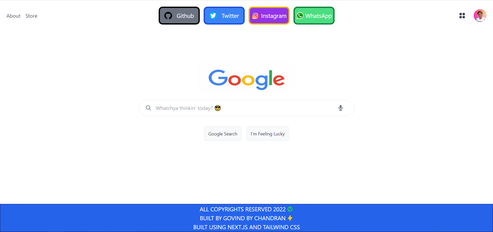
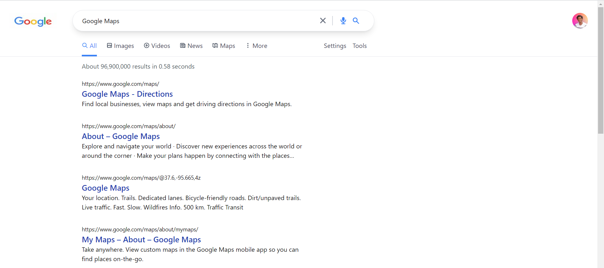

# Google 2.0
## A google clone built using Next.js for faster server side rendering and routing properties, using the Google API for querying search results, and Tailwind.CSS for styling and responsiveness.

